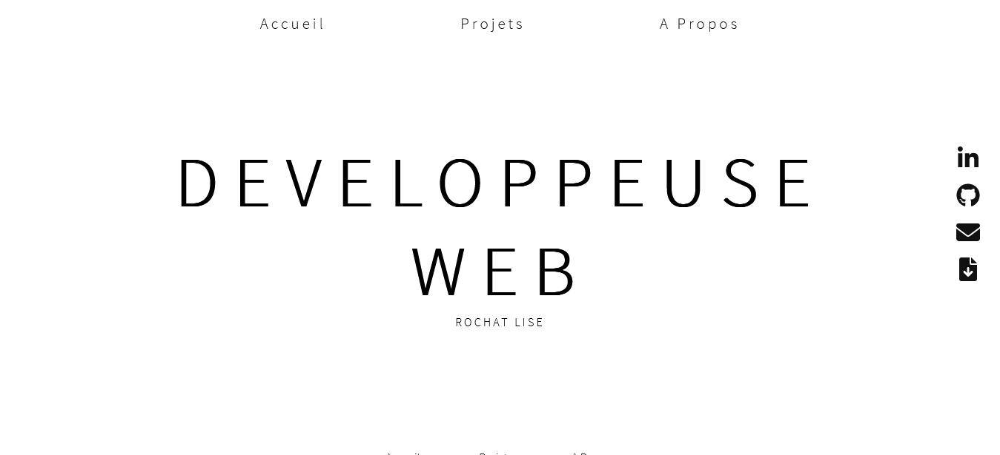

<div id="top"></div>

<div align="center">
  <h1> ROCHAT LISE | Portfolio </h1>
  <p>Creation of my Portfolio </p>
</div>

***

### Table of Content
1. [General Info](#general-info)
3. [Visual](#visual)
4. [Technologies](#technologies)
5. [Installation](#installation)
6. [RoadMap](#roadmap)
7. [Contributing](#contributing)
8. [Contact](#contact)
<p align="right">(<a href="#top">back to top</a>)</p>

***

### General Info
My website. With this project I can see all digital setors :
- Web Design
- Integration
- Development
- Admninistration 
<p align="right">(<a href="#top">back to top</a>)</p>

***

### Visual
Here is an overview of project. </br>
</br>
<div align="center">
  
</div>
<p align="right">(<a href="#top">back to top</a>)</p>

***

### Technologies
- HTML 5
- CSS 3
- W3C validator
- LightHousse Chrome plugin
- Javascript
<p align="right">(<a href="#top">back to top</a>)</p>

***
### RoadMap 

- [x] Integration HTML
- [x] Stylisation CSS
- [ ] Responsive
    - [ ] Tablet
    - [ ] Mobile
- [ ] Javascript
- [ ] Projects Presntation
- [ ] Integrate an API 
<p align="right">(<a href="#top">back to top</a>)</p>

***

### Installation

1. Clone the project
```
git clone https://github.com/LiseRochat/Portfolio/
```
2. Open file with you text editor 
3. Run index.html in your navigator
<p align="right">(<a href="#top">back to top</a>)</p>

***

### Contributing
If you have a suggestion that would make this better, please fork the repository and create a pull request. You can also simply open an issue with the tag "enhancement".

Don't forget to give the project a star! Thanks again!

1. Fork the Project
2. Create your Feature Branch (`git checkout -b feature/AmazingFeature`)
3. Commit your Changes (`git commit -m 'Add some AmazingFeature'`)
4. Push to the Branch (`git push origin feature/AmazingFeature`)
5. Open a Pull Request
<p align="right">(<a href="#top">back to top</a>)</p>

***

### Contact 
Rochat Lise - liserochat@live.fr </br>
Project Link: [https://github.com/LiseRochat/Portfolio/](https://github.com/LiseRochat/Portfolio/)
<p align="right">(<a href="#top">back to top</a>)</p>


